# 🗺️ ReUseChain: Master Unified 2D Architecture Blueprint

This document presents the **Single Source of Truth** for the end-to-end architecture of **ReUseChain**. It integrates all 4 core layers into a cohesive, high-definition 2D Mermaid diagram reflecting the active codebase:

1. **📡 Layer 1: Telemetry, Host Probing & Ingestion** (*Architecture 1: Reading*)
2. **🧠 Layer 2: Multi-Provider AI Reasoning, Vision & 14 Diagnostic Probes** (*Architecture 2: Understanding*)
3. **⚡ Layer 3: Autonomous Execution & Circularity Waterfall** (*Architecture 3: Execution*)
4. **🔐 Layer 4: Cryptographic Trust, Digital Product Passport & Persistence** (*Architecture 4: Trust & Ledger*)

---

## 🎨 Master Unified 2D Mermaid Diagram

```mermaid
flowchart TB
    %% =========================================================================
    %% LAYER 1: INGESTION & USER ACCESS POINTS
    %% =========================================================================
    subgraph L1["📡 LAYER 1: Multi-Modal Ingestion & User Portals (Architecture 1: Reading)"]
        direction TB
        subgraph L1_HOST["🖥️ Local Host Windows Pro Environment"]
            WMI_POWERSHELL["⚙️ PowerShell WMI/CIM Telemetry Collector<br/><code>scripts/Collect-WindowsTelemetry.ps1</code><br/><i>Direct low-overhead queries for CPU, RAM, NVMe &amp; ACPI</i>"]
            DESKTOP_DAEMON["⏱️ Background Anomaly Daemon<br/><code>scripts/ReUseChain-DesktopAgent.ps1</code><br/><i>Thermal threshold watchdog &amp; task-load monitor</i>"]
        end

        subgraph L1_CLIENTS["🌐 User Portals & Mobile Access Points"]
            AI_CHECKUP["🩺 AI Quick Check Up<br/><code>src/app/desktop-agent/page.tsx</code><br/><i>Live hardware sensor radar, system health gauge &amp; 1-click remediation</i>"]
            MANUAL_ENTRY["📝 Manual Data Entry Console<br/><code>src/app/manual/page.tsx</code><br/><i>Hardware specifications, manual triage &amp; live diagnostics</i>"]
            ACTION_CHAT["💬 Thinking AI Action Chat<br/><code>src/app/assistant/page.tsx</code><br/><i>Multi-turn natural language triage, thinking chain &amp; interactive testing</i>"]
            SCREEN_UPLOAD["📷 Screen &amp; OCR Diagnostic Ingest<br/><code>src/app/api/media/route.ts</code><br/><i>Task Manager OCR, BSOD Stop Codes &amp; freeze photos</i>"]
            BACKUP_BOT["📱 Mobile Emergency Telegram Bot<br/><code>@backuvro_bot (Token: 8923070582)</code><br/><i>Triage from smartphone when host PC is unresponsive or unbootable</i>"]
        end
    end

    %% =========================================================================
    %% LAYER 2: AI UNDERSTANDING & DIAGNOSTIC ENGINES
    %% =========================================================================
    subgraph L2["🧠 LAYER 2: AI Reasoning, Vision & 14 Diagnostic Probes (Architecture 2: Understanding)"]
        direction TB
        
        subgraph L2_VISION["👁️ Optical Vision Subsystem"]
            VISION_ENGINE["Optical Vision Engine<br/><code>src/lib/vision-diagnostic-engine.ts</code><br/><i>Deep OCR parser, high-resource PID detection &amp; Windows BugCheck classifier</i>"]
        end

        subgraph L2_REASONING["🧠 Multi-Provider Thinking &amp; Reasoning Core (src/lib/hardware-ai-agent.ts)"]
            ROUTER["🔀 Provider Decoupler &amp; Model Router<br/><i>Dynamically routes queries based on capability tier &amp; latency</i>"]
            GEMINI_TIER["⭐ Google Gemini Native<br/><code>gemini-2.0-flash-thinking-exp</code><br/><i>Deep CoT reasoning, symptom root-cause verification</i>"]
            OPENROUTER_TIER["🌐 OpenRouter Enterprise Tier<br/><code>DeepSeek-R1 / Llama 3.3 70B</code><br/><i>Open-weight reasoning models &amp; versatile heuristics</i>"]
            GROQ_TIER["⚡ Groq Ultra-Low Latency<br/><code>Qwen 2.5 27B / Llama 3.3 (max_tokens: 800)</code><br/><i>Sub-10ms instantaneous triage &amp; response speed</i>"]
            LOCAL_TIER["🔒 Local Autonomous Fallback<br/><i>Offline Rule Engine</i><br/><i>Zero API key requirement • 100% private offline operation</i>"]
        end

        subgraph L2_TOOLS["🔬 14 Native Host Diagnostic Probes (Win32 / CIM)"]
            subgraph L2_DIRECT["Direct Host Telemetry Probes"]
                T_CPU_DIR["1. CPU Direct<br/><code>Win32_Processor</code>"]
                T_RAM_DIR["2. RAM Direct<br/><code>Win32_OperatingSystem</code>"]
                T_GPU_DIR["3. GPU Direct<br/><code>Win32_VideoController</code>"]
                T_STORAGE_DIR["4. Storage SMART<br/><code>Win32_DiskDrive</code>"]
                T_BATTERY_DIR["5. Battery ACPI<br/><code>Win32_Battery</code>"]
                T_DEVICE_DIR["6. PnP Hardware Error<br/><code>Win32_PnPEntity</code>"]
                T_NETWORK_DIR["7. Network Adapter<br/><code>Get-NetAdapter</code>"]
            end
            subgraph L2_FUNC["Functional Stress &amp; Interactive Testing"]
                T_RAM_FUNC["8. RAM Memory Stress<br/><code>WorkingSet64 Benchmark</code>"]
                T_GPU_FUNC["9. GPU Direct3D Render<br/><code>Refresh Rate &amp; VRAM Probe</code>"]
                T_STORAGE_FUNC["10. Storage I/O Read/Write<br/><code>Win32_LogicalDisk Test</code>"]
                T_NETWORK_FUNC["11. Network Latency &amp; DNS<br/><code>ICMP Ping 1.1.1.1 Latency</code>"]
                T_AUDIO_FUNC["12. Audio / DAC Check<br/><code>Win32_SoundDevice</code>"]
                T_KEYBOARD_FUNC["13. Interactive Key Matrix<br/><code>Scancode &amp; Driver Tester</code>"]
                T_KERNEL_FUNC["14. OS Kernel Crash Dumps<br/><code>BugCheck Dump Verifier</code>"]
            end
        end

        subgraph L2_LEARNING["🔁 Autonomous Self-Learning &amp; Human Escalation"]
            SELF_LEARN_STORE["📚 Adaptive Knowledge Store<br/><code>src/lib/self-learning-agent.ts</code><br/><i>Caches novel incident patterns &amp; approved solutions</i>"]
            ADMIN_TELEGRAM_BOT["👨‍💼 Admin Escalation Hub<br/><code>@AHackBattle013bot (Token: 8978711876)</code><br/><i>Human-in-the-loop live bidirectional /reply bridge</i>"]
            LANGGRAPH_STATE["🕸️ LangGraph Multi-Agent Coordinator<br/><code>src/lib/langgraph/workflow.ts</code><br/><i>Manages diagnostic agent state, handoffs &amp; memories</i>"]
        end
    end

    %% =========================================================================
    %% LAYER 3: AUTONOMOUS EXECUTION & CIRCULARITY WATERFALL
    %% =========================================================================
    subgraph L3["⚡ LAYER 3: Autonomous Execution & Circularity Waterfall (Architecture 3: Execution)"]
        direction TB
        
        TRIAGE_GATE{"⚖️ Circularity Triage Decision Gate<br/><i>Inspect ➔ Repair ➔ Reuse ➔ Recycle</i>"}

        subgraph L3_HEALTHY["✅ Baseline Nominal State"]
            HEALTHY_OUT["All Systems Nominal &amp; Healthy<br/><i>Zero Booking Required • 100% Operational Baseline</i>"]
        end

        subgraph L3_REPAIR["🛠️ 1. REPAIR: ONDC Doorstep Service Network"]
            ONDC_BOOK["ONDC Dispatch &amp; Booking API<br/><code>/api/ondc/services</code><br/><i>Zero manual form-filling • Auto-populated profile</i>"]
            SPECIALIST["Assigned Doorstep Specialist<br/><b>Alex Rivera</b> (Dell / HP Certified Specialist)"]
            GPS_RADAR["🛰️ Real-Time GPS Telemetry Radar<br/><code>src/app/track/[id]/page.tsx</code><br/><i>Live map tracking, route geometry &amp; ETA countdown</i>"]
            CANCEL_BUTTON["🛑 1-Click Order Cancellation<br/><code>/api/ondc/cancel</code><br/><i>Cancels technician &amp; auto-releases escrow hold</i>"]
        end

        subgraph L3_REUSE["🔄 2. REUSE: Modular Salvage &amp; Circular Blueprints"]
            SALVAGE_EVAL["Component Harvester Evaluator<br/><i>Tests DDR RAM, NVMe SSD &amp; Display viability</i>"]
            BLUEPRINTS["📋 Turnkey Open-Source Blueprints<br/><code>/assistant</code> • <code>/passport</code><br/><i>• Low-Power Linux NAS Server<br/>• Home Media Hub (Jellyfin/Plex)<br/>• Pi-hole Network Ad-Blocker<br/><b>Avoids 34.8 kg CO2e per Device</b></i>"]
        end

        subgraph L3_RECYCLE["♻️ 3. RECYCLE: Zero-Landfill E-Waste Protocol"]
            RECYCLE_PARTNER["Certified E-Waste Recycler<br/><b>EcoRecycle India</b> (R2v3 &amp; ISO 14001 Compliant)"]
            SCRAP_CREDIT["💳 Instant Scrap Material Credit<br/><i>+$18.50 USD Direct Bank / UPI Transfer</i>"]
            DESTRUCTION_CERT["📜 Chemical Neutralization Certificate<br/><i>Zero-leach protocol &amp; hazardous metal neutralizer</i>"]
        end
    end

    %% =========================================================================
    %% LAYER 4: CRYPTOGRAPHIC TRUST & PERSISTENCE
    %% =========================================================================
    subgraph L4["🔐 LAYER 4: Cryptographic Trust, Digital Product Passport & Storage"]
        direction TB
        
        subgraph L4_PASSPORT["🛡️ Digital Product Passport (DPP) Ledger"]
            PASSPORT_ENGINE["Circularity Passport Engine<br/><code>src/app/passport/[id]/page.tsx</code><br/><i>EU Ecodesign &amp; Digital Product Passport Compliant</i>"]
            HASH_CHAIN["🔗 SHA-256 Merkle Audit Chain<br/><code>PassportEvent.hash = SHA-256(prevHash + eventData)</code>"]
        end

        subgraph L4_DATABASE["🗄️ Relational SQLite &amp; Prisma ORM (prisma/schema.prisma)"]
            DB_DEVICE[("📱 Device &amp; Asset Catalog")]
            DB_COMPONENT[("🧩 Component Health &amp; Degradation")]
            DB_SESSION[("🩺 DiagnosticSession &amp; ActionLogs")]
            DB_ONDC[("🚛 OndcBooking &amp; DispatchState")]
            DB_ADMIN[("👨‍💻 AdminEscalation &amp; LearnedRules")]
            DB_PASSPORT[("📜 PassportEvent (Immutable Audit)")]
        end
    end

    %% =========================================================================
    %% CROSS-LAYER FLOWS & INTERCONNECTIONS
    %% =========================================================================

    %% Ingestion to Layer 2
    WMI_POWERSHELL -->|Raw JSON Telemetry| ROUTER
    DESKTOP_DAEMON -->|Thermal Anomaly Event| ROUTER
    SCREEN_UPLOAD -->|Photo of BSOD / Task Manager| VISION_ENGINE
    AI_CHECKUP -->|Live Sensor &amp; Health Probe| ROUTER
    MANUAL_ENTRY -->|Structured Specs + Problem Input| ROUTER
    ACTION_CHAT -->|Natural Language Symptom| ROUTER
    BACKUP_BOT -->|Mobile Telegram Photo / Text| ROUTER

    %% Vision to Reasoning
    VISION_ENGINE -->|Parsed Error Signature &amp; Process PID| ROUTER

    %% Provider Routing
    ROUTER --> GEMINI_TIER
    ROUTER --> OPENROUTER_TIER
    ROUTER --> GROQ_TIER
    ROUTER --> LOCAL_TIER

    %% AI to Diagnostic Probes
    GEMINI_TIER --> L2_TOOLS
    OPENROUTER_TIER --> L2_TOOLS
    GROQ_TIER --> L2_TOOLS
    LOCAL_TIER --> L2_TOOLS

    %% Probes execution on Host
    T_CPU_DIR -.->|Executes on Host| WMI_POWERSHELL
    T_RAM_DIR -.->|Executes on Host| WMI_POWERSHELL
    T_GPU_DIR -.->|Executes on Host| WMI_POWERSHELL
    T_STORAGE_DIR -.->|Executes on Host| WMI_POWERSHELL
    T_BATTERY_DIR -.->|Executes on Host| WMI_POWERSHELL
    T_DEVICE_DIR -.->|Executes on Host| WMI_POWERSHELL
    T_NETWORK_DIR -.->|Executes on Host| WMI_POWERSHELL
    T_RAM_FUNC -.->|Executes on Host| WMI_POWERSHELL
    T_GPU_FUNC -.->|Executes on Host| WMI_POWERSHELL
    T_STORAGE_FUNC -.->|Executes on Host| WMI_POWERSHELL
    T_NETWORK_FUNC -.->|Executes on Host| WMI_POWERSHELL
    T_AUDIO_FUNC -.->|Executes on Host| WMI_POWERSHELL
    T_KEYBOARD_FUNC -.->|Executes on Host| WMI_POWERSHELL
    T_KERNEL_FUNC -.->|Executes on Host| WMI_POWERSHELL

    %% Self-Learning & Admin Loop
    ROUTER <-->|Query Learned Patterns| SELF_LEARN_STORE
    ROUTER -->|Unresolved Anomaly Escalation| ADMIN_TELEGRAM_BOT
    ADMIN_TELEGRAM_BOT -->|Admin /reply Command| SELF_LEARN_STORE
    ADMIN_TELEGRAM_BOT -->|Live Stream Response to User| ACTION_CHAT
    ADMIN_TELEGRAM_BOT -->|Direct Mobile Message| BACKUP_BOT
    LANGGRAPH_STATE -.->|Coordinates Handoff States| ROUTER

    %% Diagnostic Result to Triage Gate
    L2_TOOLS -->|Diagnostic Telemetry &amp; Evidence| TRIAGE_GATE

    %% Triage Decision Split
    TRIAGE_GATE -->|Verdict: HEALTHY| HEALTHY_OUT
    TRIAGE_GATE -->|Verdict: REPAIR| ONDC_BOOK
    TRIAGE_GATE -->|Verdict: REUSE| SALVAGE_EVAL
    TRIAGE_GATE -->|Verdict: RECYCLE| RECYCLE_PARTNER

    %% Repair Execution Sub-flow
    ONDC_BOOK --> SPECIALIST
    ONDC_BOOK --> GPS_RADAR
    GPS_RADAR --> CANCEL_BUTTON
    CANCEL_BUTTON -->|POST /api/ondc/cancel| ONDC_BOOK

    %% Reuse Execution Sub-flow
    SALVAGE_EVAL --> BLUEPRINTS

    %% Recycle Execution Sub-flow
    RECYCLE_PARTNER --> SCRAP_CREDIT
    RECYCLE_PARTNER --> DESTRUCTION_CERT

    %% Circular Actions to Passport Ledger
    HEALTHY_OUT -->|DIAGNOSTIC_COMPLETED| HASH_CHAIN
    ONDC_BOOK -->|TELEGRAM_HW_DISPATCH| HASH_CHAIN
    CANCEL_BUTTON -->|ORDER_CANCELLED_RELEASE| HASH_CHAIN
    BLUEPRINTS -->|REUSE_BLUEPRINT_SEALED| HASH_CHAIN
    DESTRUCTION_CERT -->|EWASTE_DESTRUCTION_CERT| HASH_CHAIN
    SELF_LEARN_STORE -->|RULE_RECORDED| HASH_CHAIN

    %% Ledger to Storage
    HASH_CHAIN --> PASSPORT_ENGINE
    PASSPORT_ENGINE --> DB_PASSPORT
    ONDC_BOOK --> DB_ONDC
    ADMIN_TELEGRAM_BOT --> DB_ADMIN
    L2_TOOLS --> DB_SESSION
    MANUAL_ENTRY --> DB_DEVICE
    SALVAGE_EVAL --> DB_COMPONENT

    %% Real-time UI Tracking Updates
    GPS_RADAR -.->|Live Radar Telemetry| AI_CHECKUP
    GPS_RADAR -.->|In-Chat Tracking Card| ACTION_CHAT
    PASSPORT_ENGINE -.->|Visual Verification| ACTION_CHAT

    %% =========================================================================
    %% STYLING AND THEME (Modern Dark Mode with Glowing Accents)
    %% =========================================================================
    classDef l1Style fill:#091e3a,stroke:#0284c7,stroke-width:2px,color:#bae6fd;
    classDef l2Style fill:#1a0f2e,stroke:#7c3aed,stroke-width:2px,color:#e9d5ff;
    classDef l3Style fill:#042f2e,stroke:#059669,stroke-width:2px,color:#a7f3d0;
    classDef l4Style fill:#1c1917,stroke:#d97706,stroke-width:2px,color:#fde68a;
    classDef gateStyle fill:#312e81,stroke:#6366f1,stroke-width:3px,color:#ffffff,font-weight:bold;
    classDef cancelStyle fill:#881337,stroke:#f43f5e,stroke-width:2px,color:#ffe4e6,font-weight:bold;
    classDef actionStyle fill:#0369a1,stroke:#38bdf8,stroke-width:2px,color:#ffffff,font-weight:bold;
    classDef dbStyle fill:#1e293b,stroke:#64748b,stroke-width:2px,color:#f1f5f9;

    class L1,L1_HOST,L1_CLIENTS l1Style;
    class L2,L2_VISION,L2_REASONING,L2_TOOLS,L2_DIRECT,L2_FUNC,L2_LEARNING l2Style;
    class L3,L3_HEALTHY,L3_REPAIR,L3_REUSE,L3_RECYCLE l3Style;
    class L4,L4_PASSPORT,L4_DATABASE l4Style;
    class TRIAGE_GATE gateStyle;
    class CANCEL_BUTTON cancelStyle;
    class ONDC_BOOK,BLUEPRINTS,SCRAP_CREDIT actionStyle;
    class DB_DEVICE,DB_COMPONENT,DB_SESSION,DB_ONDC,DB_ADMIN,DB_PASSPORT dbStyle;
```

---

## 🔍 Subsystem Key & Architecture Cross-Reference

| Layer | Subsystem / Component | Primary Source File | Function & Integration |
| :--- | :--- | :--- | :--- |
| **L1: Ingestion** | **AI Quick Check Up** | [`src/app/desktop-agent/page.tsx`](file:///c:/Users/banks/ReUseChain/src/app/desktop-agent/page.tsx) | Live Windows telemetry gauge, automatic maintenance runner &amp; real-time sensor radar. |
| **L1: Ingestion** | **PowerShell WMI Ingestion** | [`scripts/Collect-WindowsTelemetry.ps1`](file:///c:/Users/banks/ReUseChain/scripts/Collect-WindowsTelemetry.ps1) | Low-level Win32 hardware sensor collection to structured JSON. |
| **L1: Ingestion** | **Desktop Background Daemon** | [`scripts/ReUseChain-DesktopAgent.ps1`](file:///c:/Users/banks/ReUseChain/scripts/ReUseChain-DesktopAgent.ps1) | Continuous daemon monitoring thermal junction points and system load anomalies. |
| **L1: Ingestion** | **Manual Data Entry** | [`src/app/manual/page.tsx`](file:///c:/Users/banks/ReUseChain/src/app/manual/page.tsx) | Technician console for hardware spec input and 1-click diagnostic verification. |
| **L1: Ingestion** | **Emergency Mobile Bot** | [`@backuvro_bot`](https://t.me/backuvro_bot) | Mobile Telegram bot enabling triage with photos when PC cannot boot or display is off. |
| **L2: Reasoning** | **Multi-Provider AI Core** | [`src/lib/hardware-ai-agent.ts`](file:///c:/Users/banks/ReUseChain/src/lib/hardware-ai-agent.ts) | Decoupled router supporting Gemini Thinking, OpenRouter (DeepSeek-R1), Groq, and Local rules. |
| **L2: Diagnostics** | **14 Native Host Tools** | [`src/lib/hardware-ai-agent.ts:L18-L135`](file:///c:/Users/banks/ReUseChain/src/lib/hardware-ai-agent.ts#L18-L135) | 7 Direct Host Telemetry + 7 Functional Stress &amp; Interactive Matrix probes. |
| **L2: Vision** | **Optical Vision Engine** | [`src/lib/vision-diagnostic-engine.ts`](file:///c:/Users/banks/ReUseChain/src/lib/vision-diagnostic-engine.ts) | OCR parsing for BSOD Stop Codes and high-resource Task Manager PIDs. |
| **L2: Learning** | **Adaptive Self-Learning** | [`src/lib/self-learning-agent.ts`](file:///c:/Users/banks/ReUseChain/src/lib/self-learning-agent.ts) | Caches verified technician solutions as permanent autonomous resolution rules. |
| **L2: Escalation** | **Admin Telegram Bridge** | [`@AHackBattle013bot`](https://t.me/AHackBattle013bot) | Dual Telegram bot receiving unknown issues with `/reply` command bridge. |
| **L3: Execution** | **ONDC Doorstep Dispatch** | [`src/app/api/ondc/services/route.ts`](file:///c:/Users/banks/ReUseChain/src/app/api/ondc/services/route.ts) | Auto-dispatches certified specialist Alex Rivera with zero manual form filling. |
| **L3: Execution** | **Live GPS Telemetry** | [`src/app/track/[id]/page.tsx`](file:///c:/Users/banks/ReUseChain/src/app/track/%5Bid%5D/page.tsx) | Real-time vehicle radar, milestone timeline, and coordinate tracking. |
| **L3: Execution** | **Order Cancellation** | [`src/app/api/ondc/cancel/route.ts`](file:///c:/Users/banks/ReUseChain/src/app/api/ondc/cancel/route.ts) | 1-click cancellation, specialist notification, and escrow hold release. |
| **L3: Execution** | **Modular Salvage Reuse** | [`src/app/api/assistant/route.ts`](file:///c:/Users/banks/ReUseChain/src/app/api/assistant/route.ts) | Turnkey blueprints for home NAS, media server, and DNS ad-blocker salvage (34.8 kg CO2e avoided). |
| **L3: Execution** | **Certified E-Waste Scrap** | [`src/app/api/assistant/route.ts`](file:///c:/Users/banks/ReUseChain/src/app/api/assistant/route.ts) | Zero-landfill pickup with EcoRecycle India &amp; instant scrap cash payment. |
| **L4: Trust** | **Circularity Passport** | [`src/app/passport/[id]/page.tsx`](file:///c:/Users/banks/ReUseChain/src/app/passport/%5Bid%5D/page.tsx) | Cryptographic SHA-256 Merkle chain proving lifecycle chain of custody (EU DPP Ready). |
| **L4: Database** | **Prisma SQLite dev.db** | [`prisma/schema.prisma`](file:///c:/Users/banks/ReUseChain/prisma/schema.prisma) | Relational database persisting devices, components, sessions, dispatches, and audit events. |

---

## 🚀 Interactive Exploration in Web Application

Navigate to [**http://localhost:3000/graph**](http://localhost:3000/graph) ([`src/app/graph/page.tsx`](file:///c:/Users/banks/ReUseChain/src/app/graph/page.tsx)) to explore this unified graph with interactive node filtering, scenario tracing, and 1-click mermaid code copying.
